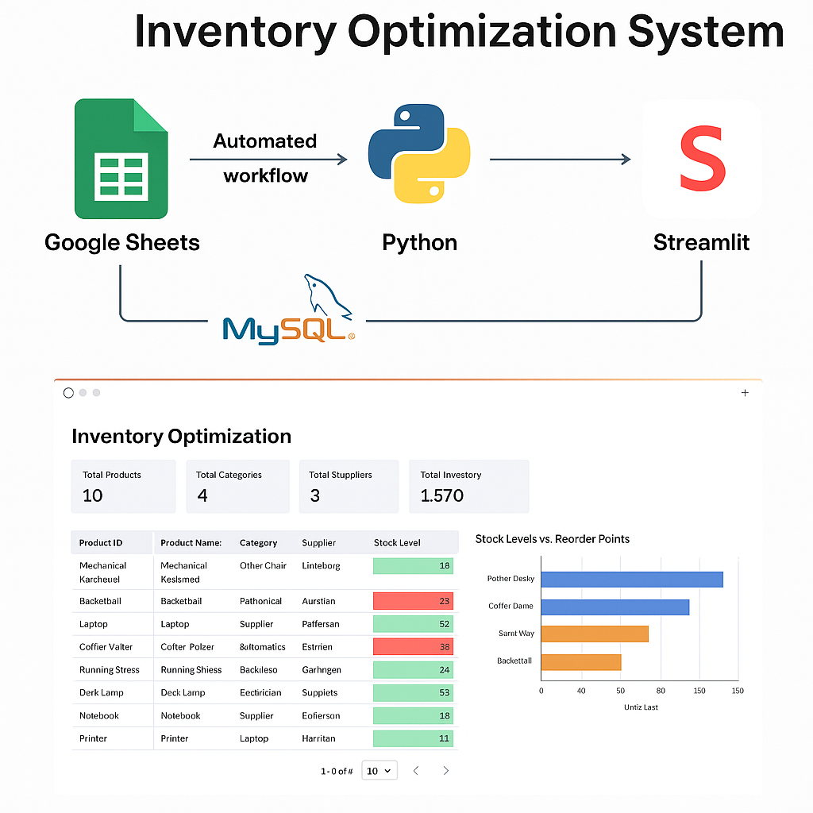

# Inventory Optimization System

## Project Workflow Diagram



*Automated data flow from Google Sheets to MySQL, processed by Python, and visualized via Streamlit.*


## Overview
The **Inventory Optimization System** is an automated workflow that collects inventory data from Google Sheets, uploads it to a MySQL database, and visualizes the information through an interactive Streamlit dashboard. This system helps businesses optimize stock levels, reduce excess inventory, and make informed decisions based on real-time data.

## Features
- Automated synchronization of inventory data from Google Sheets to MySQL
- Real-time dashboard displaying stock levels, reorder points, and target inventory
- Easy-to-use and customizable Streamlit interface
- Supports continuous data updates with minimal manual effort

## Technologies Used
- Google Sheets (Data Entry & Source)
- MySQL (Database Storage)
- Python (Data Processing & Automation)
- Streamlit (Dashboard & Visualization)

## Real-World Use Cases

### 1. Retail Stores  
Manage stock levels of fast-moving consumer goods (FMCG), clothing, or electronics by tracking real-time inventory data. The system helps avoid overstocking or stockouts by alerting when products reach reorder points.

### 2. E-Commerce Businesses  
Monitor inventory across multiple warehouses or sellers to maintain optimal stock levels. The dashboard enables quick decisions on replenishment based on current sales trends and stock availability.

### 3. Manufacturing Plants  
Track raw materials and components inventory to ensure smooth production without delays. The system helps balance inventory costs and production requirements by forecasting reorder points.

### 4. Restaurants and Food Services  
Optimize inventory of perishable goods by monitoring daily usage and expiry dates. Reduce food waste by timely reordering and maintaining target stock levels based on consumption patterns.

### 5. Automotive Dealerships  
Manage spare parts inventory efficiently to reduce idle stock and improve parts availability. The dashboard supports decision-making to reorder parts just in time for servicing and repairs.

### 6. Pharmaceuticals  
Maintain critical stock levels of medicines and supplies to comply with regulatory requirements. Automated alerts and real-time tracking prevent stockouts of essential drugs.

## Installation

1. Clone the repository:
    ```bash
    git clone https://github.com/yourusername/inventory-optimization-system.git
    cd inventory-optimization-system
    ```

2. Install Python dependencies:
    ```bash
    pip install -r requirements.txt
    ```

3. Set up Google Sheets API credentials and MySQL database configuration in `config.py`.

## Usage

1. Make sure your Google Sheet contains required columns such as:
   - product_id
   - product_name
   - category
   - supplier
   - reorder_point
   - target_stock_level

2. Run the data synchronization script to upload data from Google Sheets to MySQL:
    ```bash
    python data_sync.py
    ```

3. Launch the Streamlit dashboard:
    ```bash
    streamlit run app.py
    ```

4. Open the URL displayed in your terminal to access the interactive dashboard.

